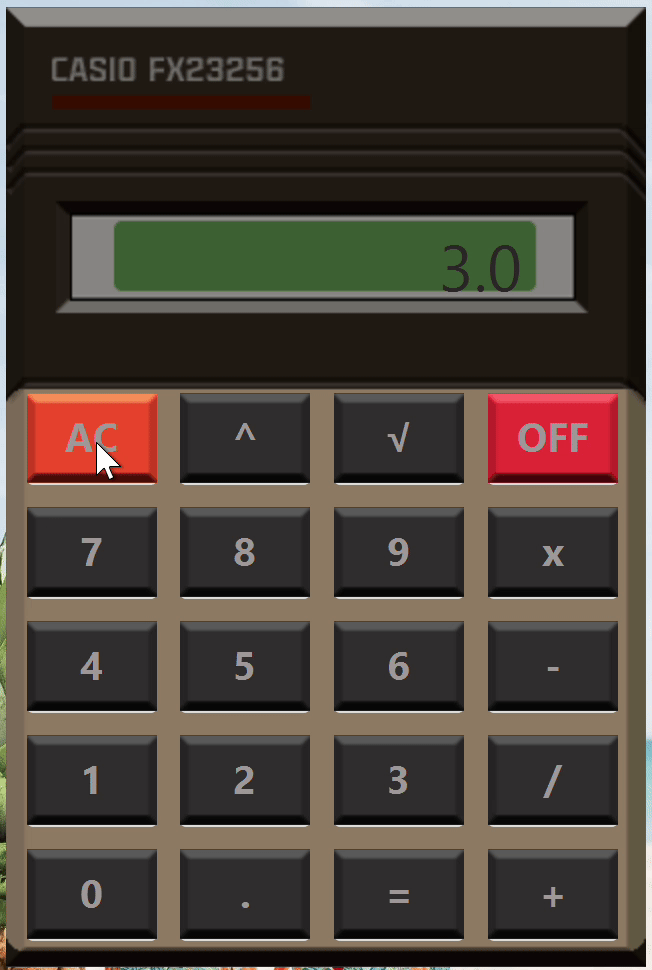
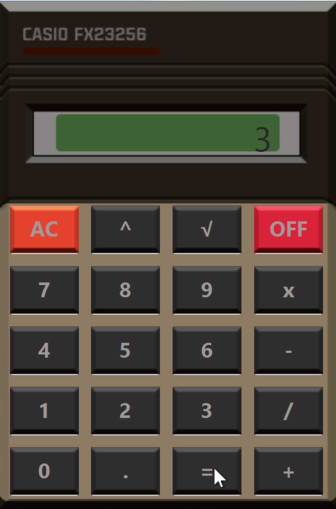

# Калькудятор
Простой калькулятор в стиле Casio.
<p align="center">

  
</p>

 ## Попробовать
[JRE](https://github.com/wracce/casio-calculator/releases/tag/v0.0.1)

Для запуска (Поменяйте логин и пароль Postgres на свой):
```bash
java -jar casio-calculator.jar
```

## Стек технологий
 * Java
 * JavaFX

## Сборка
```bash
mvn clean install compile package
```

## Лицензия
MIT license!
